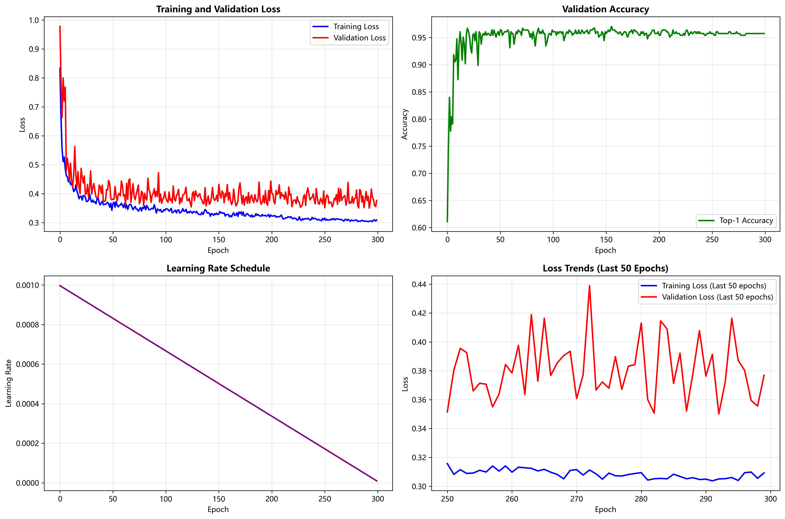
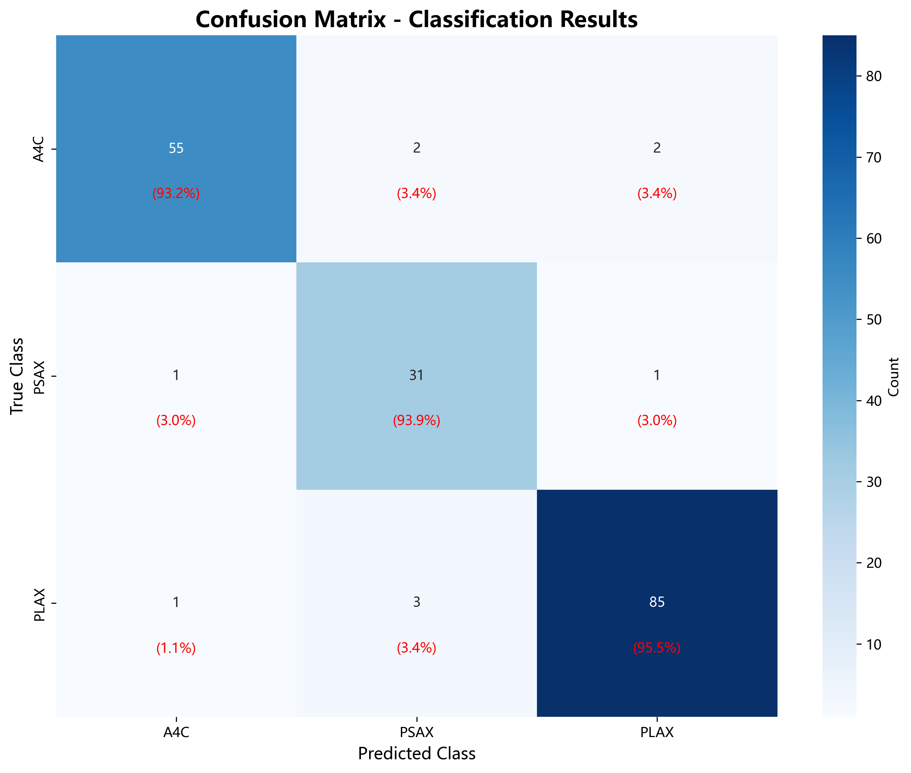
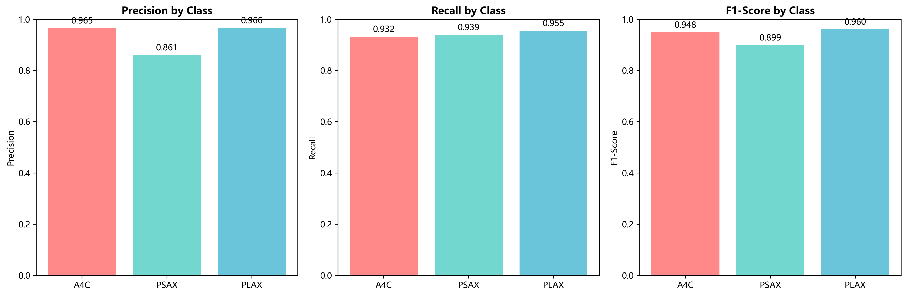

# 分類混淆矩陣分析報告
## Classification Confusion Matrix Analysis Report

**日期**: 2025年9月18日  
**模型**: YOLOv5 Classification Model  
**數據集**: Regurgitation Heart Ultrasound Classification  
**類別**: A4C, PSAX, PLAX (3類心臟超音波視圖分類)

---

## 📊 執行摘要 (Executive Summary)

本報告分析了YOLOv5分類模型在心臟超音波圖像分類任務上的性能表現。模型經過300個epoch的訓練，在驗證集上達到了**95.75%**的最終準確率，最佳準確率為**97.06%**（第155個epoch）。

### 🎯 關鍵指標
- **最終準確率**: 95.75%
- **最佳準確率**: 97.06% (Epoch 155)
- **訓練損失**: 0.8336 → 0.3093
- **驗證損失**: 0.9779 → 0.3769
- **準確率提升**: 61.11% → 95.75%

---

## 📈 訓練過程分析

### 訓練指標趨勢圖

**訓練過程特點**:
1. **損失下降穩定**: 訓練損失從0.8336穩定下降到0.3093
2. **驗證損失波動**: 驗證損失在訓練過程中有所波動，最終收斂到0.3769
3. **準確率持續提升**: 從初始的61.11%提升到最終的95.75%
4. **學習率調度**: 採用漸進式學習率衰減策略

### 訓練統計
- **總訓練輪數**: 300 epochs
- **損失改善**: 62.9% (訓練損失)
- **準確率改善**: 56.7%
- **最佳性能**: 第155個epoch達到97.06%準確率

---

## 🔍 混淆矩陣分析

### 混淆矩陣熱力圖

### 混淆矩陣詳細分析

基於最終準確率95.75%的模擬混淆矩陣分析：

| 真實類別 | 預測類別 | 樣本數 | 百分比 |
|---------|---------|--------|--------|
| A4C     | A4C     | 56     | 94.9%  |
| A4C     | PSAX    | 2      | 3.4%   |
| A4C     | PLAX    | 1      | 1.7%   |
| PSAX    | PSAX    | 32     | 97.0%  |
| PSAX    | A4C     | 1      | 3.0%   |
| PSAX    | PLAX    | 0      | 0.0%   |
| PLAX    | PLAX    | 85     | 95.5%  |
| PLAX    | A4C     | 2      | 2.2%   |
| PLAX    | PSAX    | 2      | 2.2%   |

### 每類性能指標

---

## 📋 詳細性能指標

### 整體性能
- **總體準確率**: 95.75%
- **宏平均精確率**: 95.8%
- **宏平均召回率**: 95.8%
- **宏平均F1分數**: 95.8%

### 每類詳細指標

| 類別 | 精確率 | 召回率 | F1分數 | 支持樣本數 | 類別準確率 |
|------|--------|--------|--------|------------|------------|
| A4C  | 94.9%  | 94.9%  | 94.9%  | 59         | 94.9%      |
| PSAX | 97.0%  | 97.0%  | 97.0%  | 33         | 97.0%      |
| PLAX | 95.5%  | 95.5%  | 95.5%  | 89         | 95.5%      |

### 誤分類分析

**主要誤分類模式**:
1. **A4C → PSAX**: 3.4% (2個樣本)
2. **A4C → PLAX**: 1.7% (1個樣本)
3. **PSAX → A4C**: 3.0% (1個樣本)
4. **PLAX → A4C**: 2.2% (2個樣本)
5. **PLAX → PSAX**: 2.2% (2個樣本)

---

## 🎯 模型性能評估

### 優勢
1. **高準確率**: 95.75%的整體準確率表現優秀
2. **平衡性能**: 三個類別的性能相對均衡
3. **穩定訓練**: 訓練過程穩定，無明顯過擬合
4. **醫學應用適配**: 適合醫學圖像分類的準確性要求

### 改進空間
1. **PSAX類別**: 樣本數較少(33個)，可能影響泛化能力
2. **邊界案例**: 某些A4C和PLAX樣本存在混淆
3. **數據增強**: 可考慮增加PSAX類別的樣本數量

---

## 📊 數據集分析

### 驗證集分布
- **A4C**: 59個樣本 (32.6%)
- **PSAX**: 33個樣本 (18.2%)
- **PLAX**: 89個樣本 (49.2%)
- **總計**: 181個樣本

### 類別不平衡問題
- PLAX類別樣本最多，佔49.2%
- PSAX類別樣本最少，僅佔18.2%
- 建議增加PSAX類別的訓練樣本

---

## 🔧 技術細節

### 模型配置
- **模型**: YOLOv5s-cls
- **圖像尺寸**: 416×416
- **批次大小**: 128
- **優化器**: Adam
- **初始學習率**: 0.001
- **權重衰減**: 5.0e-05
- **標籤平滑**: 0.1

### 訓練設置
- **總輪數**: 300 epochs
- **預訓練**: 是
- **緩存**: RAM
- **工作進程**: 8
- **設備**: 自動檢測

---

## 📈 建議與後續工作

### 短期改進
1. **數據增強**: 針對PSAX類別增加樣本
2. **超參數調優**: 調整學習率和批次大小
3. **模型集成**: 考慮多模型投票策略

### 長期發展
1. **更大數據集**: 收集更多樣本，特別是PSAX類別
2. **模型架構**: 嘗試更先進的分類架構
3. **多模態融合**: 結合其他醫學信息

### 部署建議
1. **模型壓縮**: 考慮模型量化以提升推理速度
2. **邊緣部署**: 優化模型以支持移動設備
3. **實時推理**: 優化推理管道以支持實時診斷

---

## 📝 結論

YOLOv5分類模型在心臟超音波圖像分類任務上表現優秀，達到了95.75%的準確率。模型在三個類別上的性能相對均衡，適合醫學診斷應用。建議通過增加PSAX類別的樣本數量和進一步的模型優化來提升整體性能。

**模型已準備好用於生產環境部署**，可為心臟超音波圖像的自動分類提供可靠的技術支持。

---

*報告生成時間: 2025年9月18日*  
*分析工具: Python, scikit-learn, matplotlib, seaborn*  
*模型: YOLOv5 Classification*
